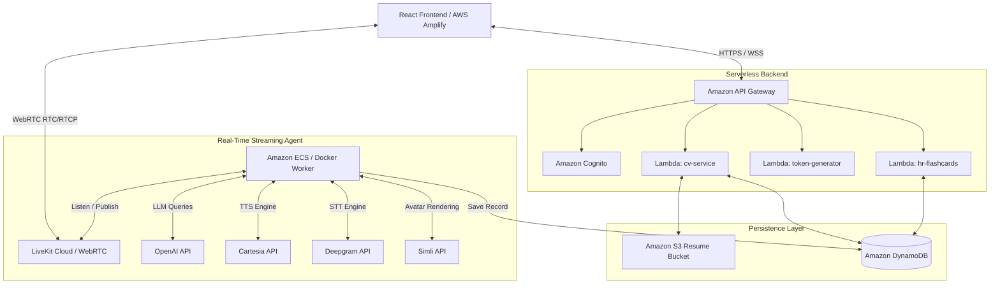
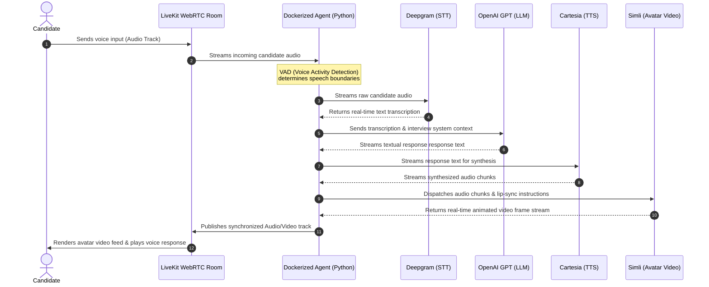
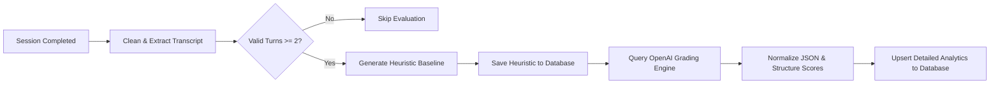

# HireMe

> [!WARNING]
> ### ⚠️ Project Status: Work In Progress (WIP)
> This project is currently undergoing active development, cleanup, and infrastructure updates. Features, deployment guides, and API schemas are subject to change.

HireMe is a state-of-the-art, AI-driven job interview simulation web application designed to help candidates practice, refine, and master their interview skills. By merging real-time generative audio/video streaming, conversational AI, and personalized analytics, HireMe replicates a high-pressure, realistic corporate interview environment. Candidates receive tailored technical and behavioral questions mapped directly to their experience, accompanied by granular, actionable feedback to guide their career preparation.

---

## 1. Project Title & Overview

**HireMe** acts as an end-to-end rehearsal platform for job seekers. Traditional preparation relies on static flashcards or peer mock interviews, which often lack specialized technical depth or objective grading. HireMe solves this by deploying a lifelike, low-latency AI interviewer avatar capable of dynamic conversation. 

The core objectives of the system are:
* **Personalization:** Tailoring the entire interview experience using the candidate’s actual background and target role.
* **Realism:** Simulating face-to-face communication using synchronized real-time video streaming, natural-sounding voice synthesis, and context-aware turn detection.
* **Objective Evaluation:** Parsing candidate transcripts to generate quantitative scores across communication and technical competencies, paired with qualitative improvement plans.

---

## 2. Key Features

### 📄 Interactive CV Builder
* **Resume Parsing & Management:** Users can upload, edit, and manage their resumes directly in the application.
* **Context Foundation:** The parsed resume data serves as the foundation for the simulation, allowing the AI to generate personalized technical and behavioral questions tailored specifically to the user's background.

### 🎥 Real-Time AI Video Avatar Streaming Pipeline
* **Dynamic Conversational Flow:** A lifelike, real-time AI avatar conducts mock interviews, responding dynamically to candidate answers.
* **Natural Conversational Pacing:** Employs advanced Voice Activity Detection (VAD) and turn-detection algorithms to allow natural pauses, conversational interruptions, and smooth handoffs.

### 📊 Post-Interview Analytics
* **Automated Feedback Generation:** Immediately following session completion, transcripts are analyzed to deliver a comprehensive performance report.
* **Granular Grading:** The system rates responses on five core parameters, identifies specific weaknesses, suggests corrected phrasing, and maps out actionable next steps.

---

## 3. System Architecture & Detailed Component Breakdown

The HireMe system is architected as a distributed cloud application, separating client-side presentation, serverless business logic, and containerized real-time streaming agents.

### Frontend Layer
* **React & JSX:** Provides a responsive, dynamic user interface with stateful components managing WebRTC video connections, transcript feeds, dashboard analytics, and resume uploads.
* **AWS Amplify:** Hosts and deploys the frontend web application directly from Git repositories. Amplify automatically manages environmental secrets, configures build pipelines, and serves content via a secure, global content delivery network.

### Backend Layer
* **Python Microservices:** Business logic, document parsing, token generation, and analytical preprocessing are written in Python for optimal integration with data processing and AI libraries.
* **AWS Lambda:** Hosts serverless Python functions that scale horizontally:
  * `cv-service`: Handles resume storage, S3 persistence, and resume-based question generation.
  * `token-generator`: Generates secure, short-lived WebRTC tokens for client access to LiveKit rooms.
  * `hr-flashcards`: Retrieves preset behavioral and HR questions for rapid practice mode.

### Cloud Infrastructure & AWS Services
* **Amazon Cognito:** Manages user registration, secure sign-in, and session token generation, securing APIs via Amazon API Gateway JWT authorizers.
* **Amazon DynamoDB:** Serves as the persistent NoSQL storage layer. It maintains user profiles, resume text structures, historical mock interview metrics, and question databases.
* **Amazon ECS (Elastic Container Service):** Executes containerized python workloads (the `hireme-agent` service). ECS dynamically provisions and manages container lifecycles to handle compute-heavy real-time WebRTC streams and background analytics generation.

---

## 4. Deep Dive: Real-Time Avatar Integration Pipeline

The most technically complex component of HireMe is the low-latency avatar integration pipeline. Packaged as a containerized Docker application, the pipeline orchestrates multiple external AI services, converting candidate voice input into synchronous, animated video streams.

### Pipeline Components & Orchestration
1. **LiveKit WebRTC Transport:** Serves as the low-latency real-time video/audio transport network. The client and Dockerized agent connect as concurrent participants in a virtual LiveKit room.
2. **Silero VAD & Multilingual Turn Detection:** Analyzes incoming client audio in real-time, identifying exactly when a candidate starts and stops speaking while filtering out background noise.
3. **Deepgram (Speech-to-Text):** Transcribes candidate speech with high accuracy. The agent streams raw audio chunks to Deepgram and receives incremental transcriptions.
4. **OpenAI GPT (Large Language Model):** Evaluates the candidate's response within the custom interview instructions context, producing the next interviewer question (limited to 2-3 short sentences for optimal pacing and lip-sync alignment).
5. **Cartesia (Text-to-Speech):** Synthesizes natural, human-sounding vocal responses. The text output is streamed into Cartesia's sonic model, producing high-fidelity audio chunks.
6. **Simli (Visual Rendering/Animation):** Takes the synthesized audio stream and maps it to a digital avatar using precise facial and lip-sync models. Simli streams back real-time visual frames synchronized with the Cartesia audio.
7. **Docker Wrapper & Worker Logic:** The entire pipeline runs as a Python worker process enclosed in a Docker container. The worker subscribes to LiveKit events, handles pre-warming of model configurations (e.g. Silero VAD loading), and coordinates the streaming loop.

---

## 5. Post-Interview Analytics & Data Processing

Once the mock interview completes, the agent triggers an asynchronous grading and data processing pipeline. This transforms the raw transcript into structured feedback stored in DynamoDB.

### Analysis & Grading Metrics
The grading engine evaluates the transcript against five critical performance categories:
1. **Communication:** Articulation, response length, pacing, and conversational structure.
2. **Technical Depth:** Understanding of core engineering principles, framework accuracy, and detail.
3. **Structure (STAR):** Utilization of the **S**ituation, **T**ask, **A**ction, and **R**esult framework.
4. **Confidence:** Assurance in tone and delivery.
5. **Role Relevance:** Specific alignment of answers with the requirements of the target position.

### Data Processing Steps
* **Transcript Extraction:** Trims silent gaps, limits turn lengths to prevent prompt bloat, and structures the dialogue chronologically.
* **Two-Stage Persistence:**
  1. **Heuristic Fallback:** The agent compiles a basic statistical review (analyzing answer length, word count, and engagement metrics) and immediately saves it to the database. This ensures that even if external LLM APIs fail, the user is not left without data.
  2. **Detailed AI Evaluation:** The transcript is analyzed by an LLM against a rigorous system prompt. It extracts strengths, details improvements (identifying the issue, suggesting a fix, and giving a concrete script example), and rates each response.
* **JSON Normalization:** The resulting JSON structure is clamped, validated, and converted into format-compatible DynamoDB entities (utilizing AWS Decimals for floating points) before replacing the heuristic fallback.

---

## 6. Getting Started & Prerequisites

To configure the HireMe system, you will need to establish environment configurations for the serverless backend, client-side application, and the real-time agent container.

### System Prerequisites
* **Docker:** Required to compile and run the real-time containerized agent.
* **Node.js (v18+):** Required to run and build the React frontend.
* **Python (v3.10+):** Required for local testing, running Lambda deployment packs, and managing python dependencies.
* **AWS CLI & Terraform:** Required to provision S3, Lambda, API Gateway, Cognito, and DynamoDB infrastructure.

### Infrastructure Configuration (AWS)
Before deploying, ensure your local environment contains credentials authorized to deploy resources via Terraform.
1. Run Terraform initialization and apply the configuration from the `/terraform` folder.
2. Set up AWS Amplify to deploy the frontend React app.
3. Configure Cognito User Pools to authorize the client application.

### Environment Variable Checklist
Configure a `.env` file within the agent and backend runtime scopes containing the following configurations:

| Variable Name | Description | Source |
|---|---|---|
| `LIVEKIT_URL` | The WebSocket URL for your LiveKit room connections | LiveKit Cloud Console |
| `LIVEKIT_API_KEY` | Developer access key for LiveKit authentication | LiveKit Cloud Console |
| `LIVEKIT_API_SECRET` | Developer secret token for LiveKit authentication | LiveKit Cloud Console |
| `OPENAI_API_KEY` | API access key for LLM generation and grading | OpenAI Developer Portal |
| `OPENAI_MODEL` | The LLM used for live conversation (e.g., `gpt-4o-mini`) | OpenAI Developer Portal |
| `SIMLI_API_KEY` | API key to initialize the Simli avatar streaming session | Simli Developer Portal |
| `SIMLI_FACE_ID` | Identifies the physical appearance of the interviewer avatar | Simli Developer Portal |
| `CARTESIA_API_KEY` | API key to authorize low-latency voice synthesis | Cartesia Console |
| `DEEPGRAM_API_KEY` | API key for high-speed speech transcription | Deepgram Console |
| `DYNAMODB_TABLE` | DynamoDB table name storing user sessions and profiles | AWS DynamoDB Console |
| `AWS_REGION` | Target deployment region (e.g., `us-east-1`) | AWS Console |
| `INTERVIEW_FEEDBACK_SINK` | Target storage adapter (`dynamodb` or `file`) | System Configuration |
